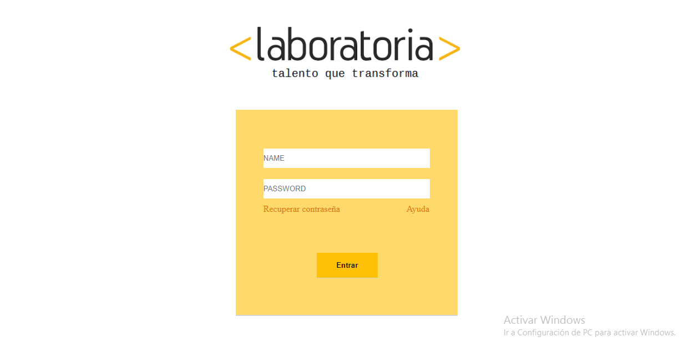
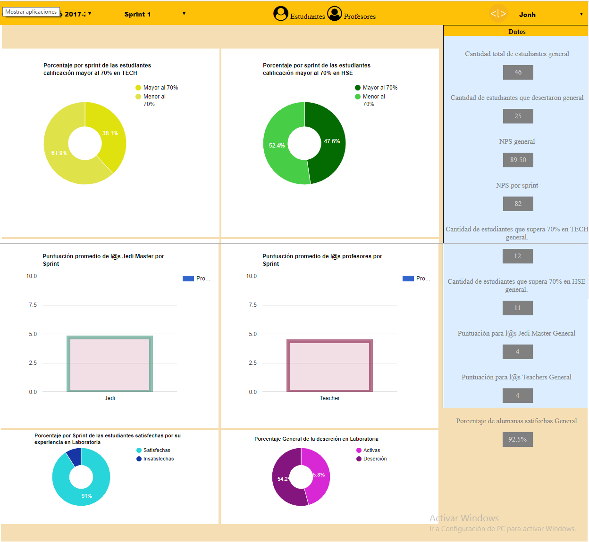
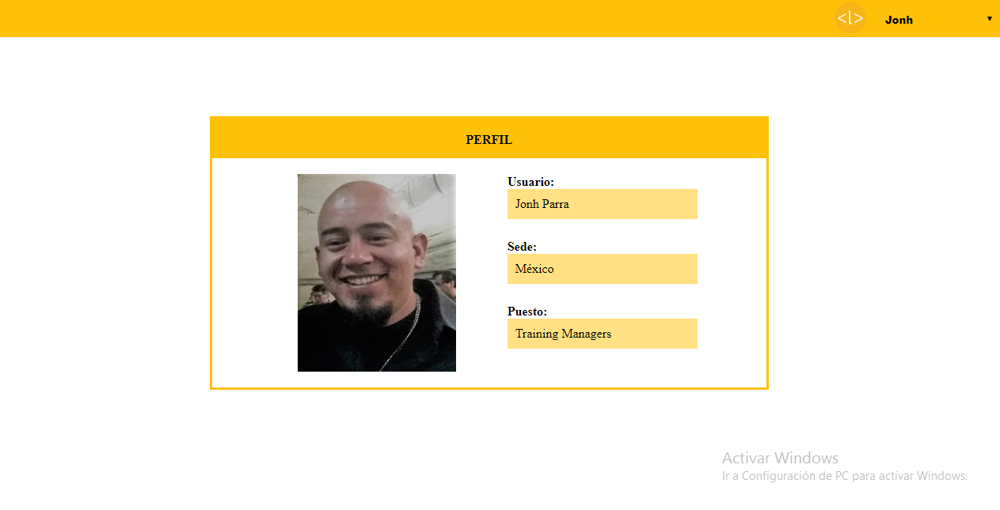

# Data Dashboard

* **Track:** _Common Core_
* **Curso:** _Creando tu primer sitio web interactivo_
* **Unidad:** _Producto final_

***

## Flujo de trabajo

1. Debes realizar un [**fork**](https://gist.github.com/ivandevp/1de47ae69a5e139a6622d78c882e1f74)
   de este repositorio.

2. Luego deberás **clonar** tu fork en tu máquina. Recuerda que el comando a usar
   es `git clone` y su estructura normalmente se ve así:

   ```bash
   git clone https://github.com/<nombre-de-usuario>/freelancer.git
   ```

3. Cuando hayas terminado tu producto, envía un Pull Request a este repositorio
   (puedes solicitar apoyo de tus profes para este paso).

> Nota: No olvides que es una buena práctica describir tu proyecto en este
> archivo `README.md` y también desplegar tu web a Github Pages :smiley:.


## PRODUCTO FINAL: DATA DASHBOARD

En este proyecto se creo una pagina web interactiva la cual es una DATA DASHBOARD de Laboratoria.

El cual la pagina principal muestra el logo de Laboratoria y es ahí donde lo
los Training Managers (TMs) tendrán que ingresar su usuario y contraseña para poder entrar a la demás información.



Ya que se haya entrado aparece otra pagina la cual tiene una barra principal  donde se puede seleccionar que sede y generación se requiere la información y otra pestaña donde se puede ingresar a un sprint deseado, por otra parte tiene otra pestaña donde se puede seleccionar el  perfil del usuario  o la lista de las estudiantes.
Y en la parte de abajo se divide en dos secciones, por una parte están las gráficas que se basan en porcentajes de lo pedido y en un costado esta un listado el cual muestra mas información pero con números.



 En caso de que se decida entrar al perfil del usuario se muestra la siguiente pantalla



y si se entra en la parte de estudiantes se muestra la siguiente pantalla.


## Diagrama de flujo.
